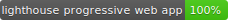
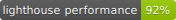
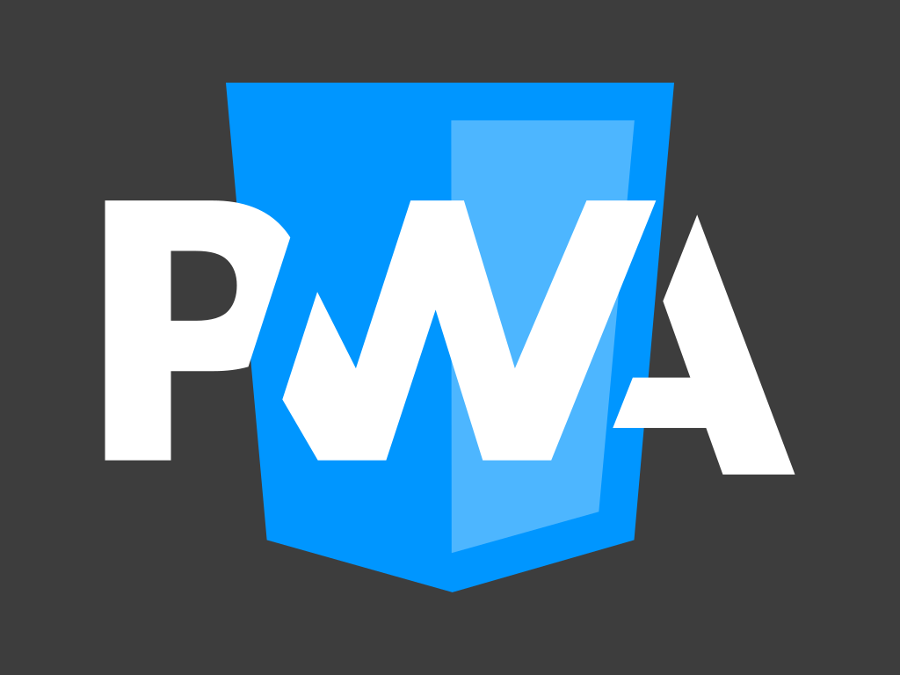
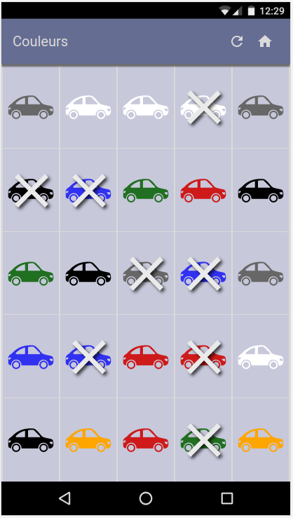
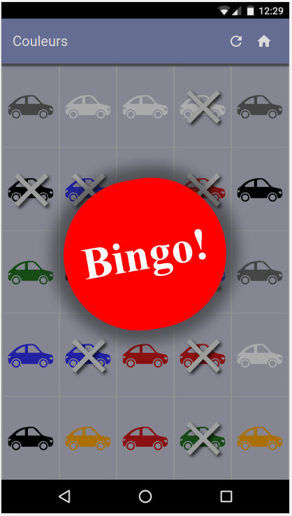
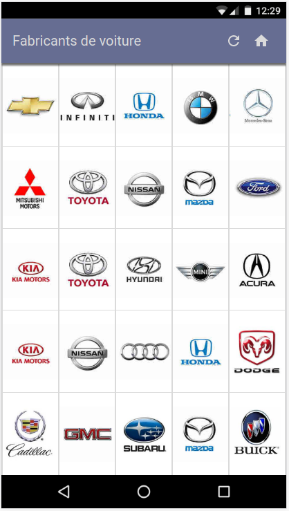
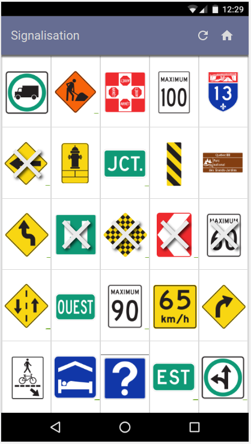

## bingo-voiture

Jeu de bingo pour les voyages en voiture.

Fonctionne hors ligne (Progressive Web App)

Voir une démo : https://bingo-voiture.firebaseapp.com

Testé sur plusieurs platforme grâce à BrowserStack http://browserstack.com/